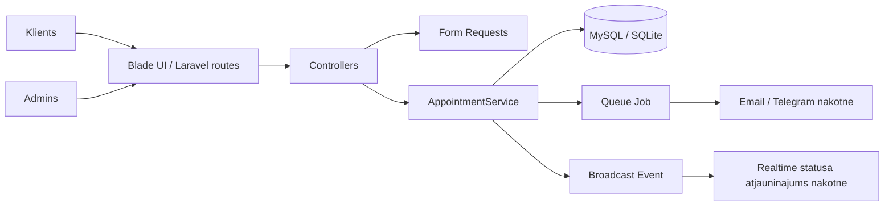

# AutoServiss

Vienkarsa autoservisa rezervaciju platforma portfolio projektam. Projekta merkis ir paradit realu biznesa plusmu: klients pievieno auto, piesaka viziti, servisa darbinieks maina statusu un pievieno izmaksas.

## Funkcijas

- Klienta un admina lomas.
- Auto profils katram klientam.
- Vizites pieteiksana ar servisa tipu un laiku.
- Aizsardziba pret divam vizitem viena laika.
- Admina darba rinda ar statusiem: rezervets, diagnostika, gaida detalu, gatavs, pabeigts, atcelts.
- Rekins ar darba un detalu izmaksam.
- Queue job pazinojumiem: `SendAppointmentStatusNotification`.
- WebSocket/Broadcast event paraugs: `AppointmentStatusChanged`.
- Feature testi galvenajam biznesa procesam.

## Tehnologijas

- Laravel 12
- PHP 8.2+
- MySQL vai SQLite lokali
- Blade views
- Laravel Queues
- PHPUnit

## Arhitekturas plusma



## Lokala palaisana

```bash
composer install
cp .env.example .env
php artisan key:generate
php artisan migrate --seed
php artisan serve
```

Ja uz Windows `php` nav PATH, izmanto pilno celu, piemeram:

```bash
C:\laragon\bin\php\php-8.3.30-Win32-vs16-x64\php.exe artisan migrate --seed
C:\laragon\bin\php\php-8.3.30-Win32-vs16-x64\php.exe artisan serve
```

Demo lietotaji pec seed:

- Klients: `client@example.com` / `password`
- Admins: `admin@example.com` / `password`

Login lapa piedava ari demo pogas bez manualas paroles ievades.

## Testi

```bash
php artisan test
```

Parbaudits:

- viesis tiek sutits uz login;
- klients var pievienot auto;
- klients var pieteikt viziti;
- nevar pieteikt divas vizites viena laika;
- klients nevar skatities cita klienta viziti;
- admins var mainit statusu un izveidot rekinu.

## Kur ko mainit

- Statusi: `app/Enums/AppointmentStatus.php`
- Lomas: `app/Enums/Role.php`
- Rezervaciju logika: `app/Services/AppointmentService.php`
- Validacija: `app/Http/Requests`
- Lapas: `resources/views`
- Datu tabulas: `database/migrations`
- Demo dati: `database/seeders/DatabaseSeeder.php`
- Testi: `tests/Feature/AutoserviceTest.php`

## Nakotnes uzlabojumi

- Pieslegt Stripe vai MakeCommerce avansa maksajumam.
- Pieslegt Telegram Bot API statusa pazinojumiem.
- Nomainit log pazinojumu uz realu e-pastu.
- Ieslegt Laravel Reverb realiem klienta statusa atjauninajumiem.
- Izvietot uz VPS ar Nginx, SSL un domenu.
